# tahmin — öngörünün disiplini

> **Tahmin, hatırlama değildir.** Yazılı olanı söylemek erişimdir; tahmin ancak
> yazılı olmayan boşlukta başlar — ve ancak **yanlışlanabilir** yazılırsa tahmindir.

<p align="center">
  
</p>

## Ne bu?

Bir yapay-zeka ajanına (ya da kendine) **iyi tahmin ettirmenin** çalışma disiplini.
Tek dosyalık bir "skill": Claude Code / benzeri ajan-ortamlarına kopyalanır,
`/tahmin` dendiğinde ya da "sence ne olacak?" sınıfı bir soru geldiğinde devreye girer.

Üç fikri var:

1. **Önce ara, sonra tahmin et.** Zaten kayıtlı olan her şey tahmin kümesinden düşer.
   Kalan boşluk gerçek tahmin alanıdır. (Atlarsan ürettiğin şey tahmin değil özettir —
   ve özet, tahmin diye sunulduğunda yanlış güven üretir.)
2. **Tek tahmin değil, sıralı küme.** 3-5 birbirini dışlayan aday + "büyük ihtimalle
   hiçbiri" seçeneği. Iska bile küme içinde bilgi taşır; tek tahmin bunu yapamaz.
3. **Her tahmin kayıt bırakır.** Append-only bir deftere düşer: tahmin · güven ·
   isabet. On tahminden sonra güven-sütunu ile isabet-sütunu karşılaştırılır —
   *"yüksek güvenli tahminlerimin kaçı tuttu?"* Bu sayı, tahmin yeteneğinin kendisidir.

## Tahmin formu

```
TAHMİN     <tek cümle, gözlenebilir sonuç>
GÜVEN      düşük / orta / yüksek
DAYANAK    neye bakarak? ("sezgi" meşru ama YAZILIR)
YANLIŞLAR  bu tahmin neyle çürür? tek cümle
ELENEN     arama sonucu düşen adaylar (zaten yazılı olanlar)
PENCERE    ne zaman sonuç belli olur
```

`ELENEN` alanı skill'in kalbi: **neyi tahmin etmediğini** yazmadan tahmin sunmak,
hatırlamayı tahmin diye satmaktır.

## Iskanın değeri

| Sonuç | Taşıdığı bilgi |
|---|---|
| TAM isabet | en az — model zaten biliyordu |
| KISMİ | yön doğru, çözünürlük düşük |
| **ISKA** | **en çok** — hangi boşluk görülmemiş, adı yazılır |

Bir ıska yazılırken tek soru: *"bunu tahmin edebilmem için neyi bilmem gerekirdi?"*
Cevap bir dosyaysa arama-rotan eksik; bir konuşmaysa geçmişi taramamışsın;
"hiçbir şey, bilinemezdi" ise — o da bir ölçümdür.

## Neden defter?

İnsan tahminleri makine tahminleriyle **aynı şemada** birikir: bir öngörü, bir sonuç,
bir isabet. Bir gün bir model bu işi devraldığında, "model iyi mi?" sorusu ancak
insan-baseline'ına karşı cevaplanabilir — ve baseline, ancak bugünden yazılırsa var olur.

## Kurulum

```
# Claude Code icin:
mkdir -p ~/.claude/skills/tahmin
cp SKILL.md ~/.claude/skills/tahmin/SKILL.md
# defter:
mkdir -p araclar/tahmin && touch araclar/tahmin/GOZLEM.md
```

Örnek defter: [`ornekler/GOZLEM-ornek.md`](ornekler/GOZLEM-ornek.md)

## Yasaklar (kısa)

- **Sonradan tahmin yasak.** Sonuç belliyken yazılan şey kayıt değil anlatıdır.
- **Güvensiz tahmin yasak.** Güven yazılmayan tahmin kalibre edilemez.
- **Tahmin kapı değildir.** "Model geçmez dedi" bir işi düşürmez; yalnız sıra ve
  dikkat yönlendirir. Kapıya bağlanan tahmin, kandırılmaya optimize edilir.

---

*Bu repo bir [LOBI](https://www.npmjs.com/package/@heraklestech/lobi) odasına bağlı —
fikir, oda-turu ve davet tek komutla üretildi (`lobi project`). Repo, çok-ajanlı bir
üretim kolonisinin içinden çıktı; defter-disiplini orada her gün gerçek işle sınanıyor.*
